# Garrux Ascii ICONS

This is an icon library containing icons, in ascii art style, of different programming technologies.

These icons have no color by default. They are black SVG images

| 
Nombre 
 | 
Icono 
                                     | 
Nombre 
 | 
Icono 
                               |
| ------------------------ | ----------------------------------------------------------- | ------------------------ | ----------------------------------------------------- |
| 1. Angular               | 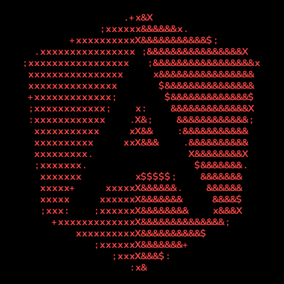          | 15. Astro                | 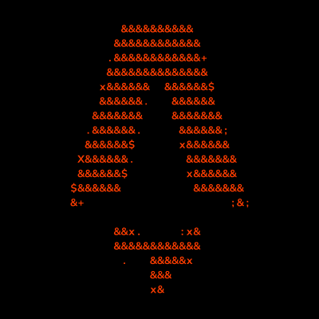      |
| 2. Bootstrap             | 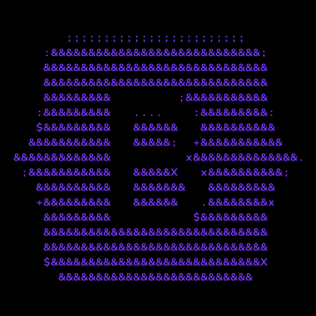        | 16. Bun                  | 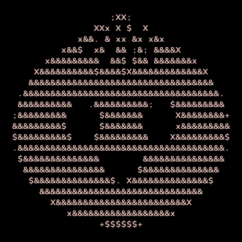        |
| 3. CSS                   | 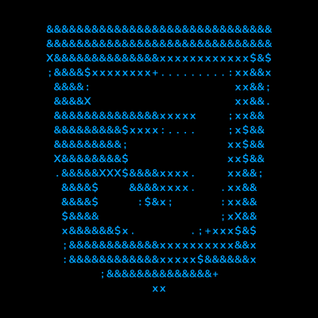              | 17. Electron             | 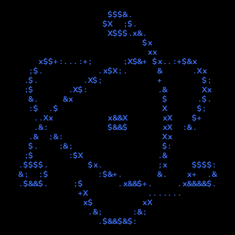   |
| 4. Esbuild               | 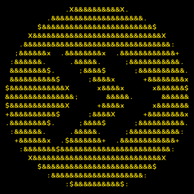          | 18. Eslint               | 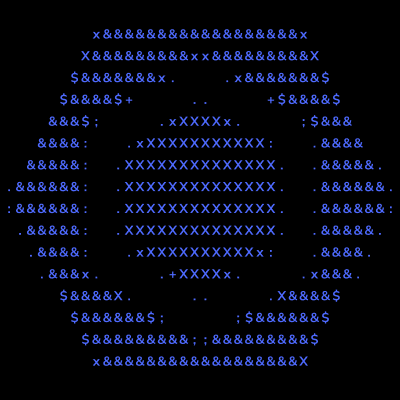     |
| 5. Golang                | 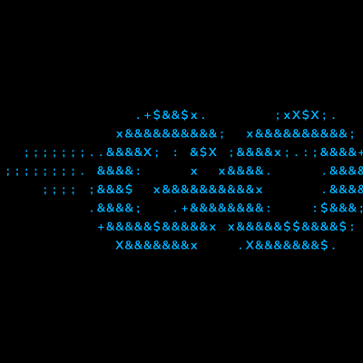           | 19. Haskell              | 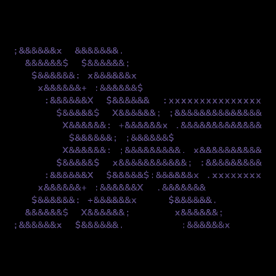    |
| 6. HTML                  | 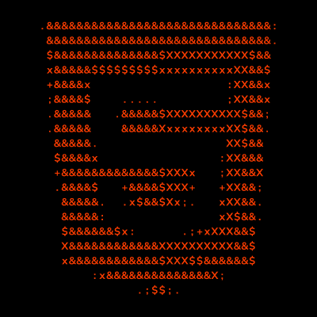             | 20. Javascript           | 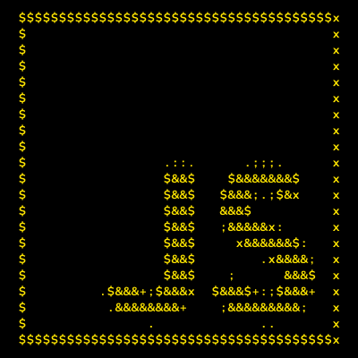         |
| 7. Jest                  | 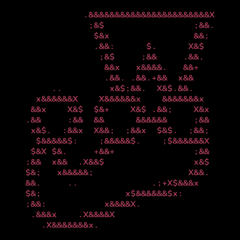             | 21. Kotlin               | 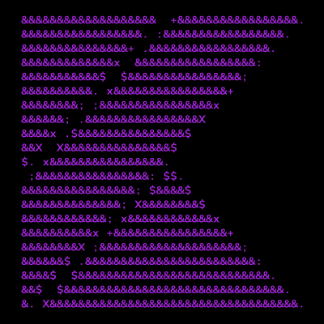     |
| 8. Mongodb               | 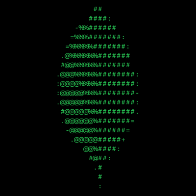          | 22. Mysql                | 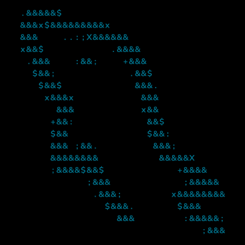      |
| 9. Nodejs                | 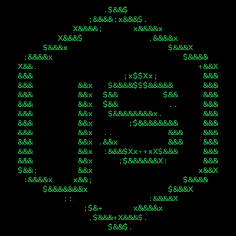           | 23. NPM                  | 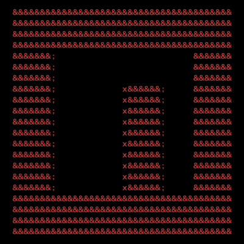        |
| 10. Prettier             | 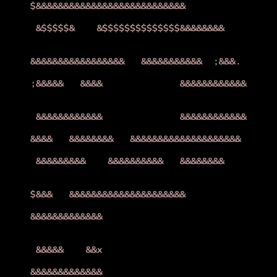         | 24. Pug                  | 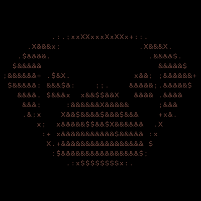        |
| 11. React                | 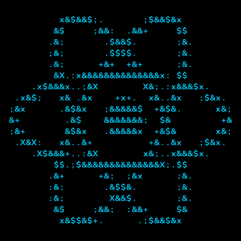            | 25. Sass                 | 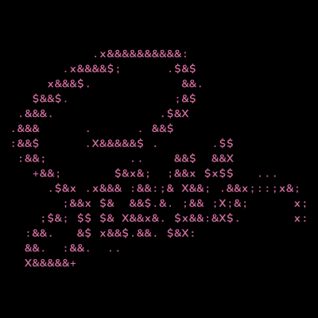       |
| 12. StyledComponents     | 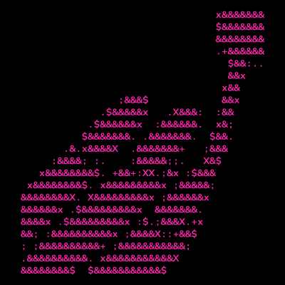 | 26. Svelte               | 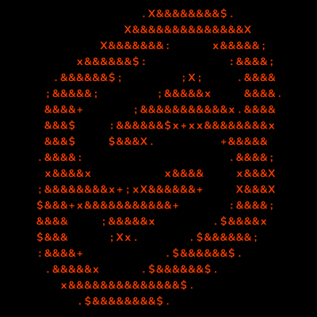     |
| 13. Tailwind             |          | 27. Typescript           | 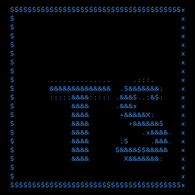 |
| 14. Vue                  | 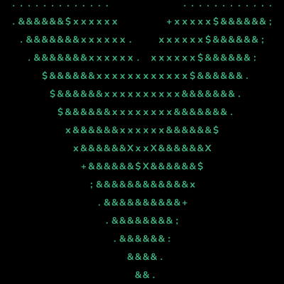              | 28. Wordpress            | 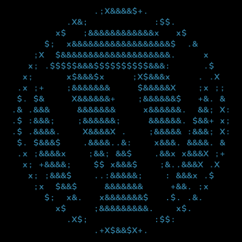  |
